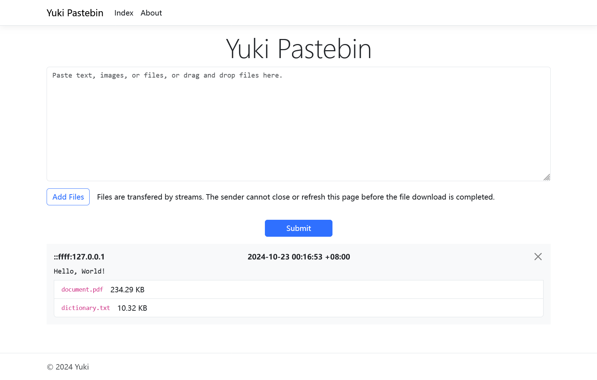

# Yuki Pastebin

Yuki Pastebin is a tool for transferring text and files, in a local (or public) network, through a simple web page.

## Getting started

### Pre-built binaries

Pre-built binaries are available on the [releases](/Yuki-Nagato/YukiPastebin/releases) page.

### From source

With Visual Studio: Just clone this repository and open `YukiPastebin.sln`, then build `YukiPastebin` project.

Or with command line: Clone this repository, install .NET 6.0 SDK, and execute:

```
dotnet run --project YukiPastebin/YukiPastebin
```

## Configuration

The configuration follows [ASP.NET Core](https://learn.microsoft.com/en-us/aspnet/core/fundamentals/configuration/?view=aspnetcore-6.0).

For example, if you want to change the server port, edit `appsettings.json` and change the value of `Urls`.

## Screenshot


